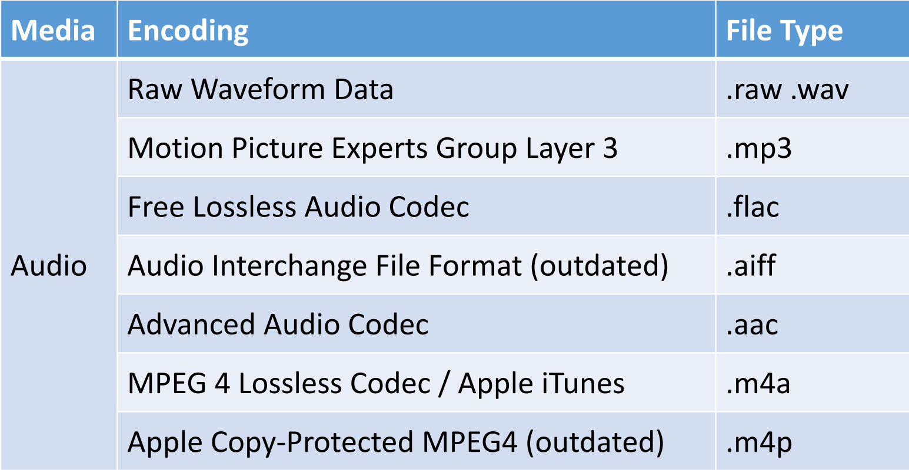

# Week2

# Files and File Types

* 开发软件需要操作各种各样的文件类型
* 文件的类型可以用两种方式表示:

  * 文件扩展名，作为文件名的一部分，用.分隔。
  * 通过文件内可由计算机读取的文件类型指示符。
* Windows是唯一需要使用文件扩展名的操作系统。Mac OS和Unix则不需要，但许多人选择使用它们，因为它非常方便，可以立即看到文件的类型。
* Windows默认在文件管理器中隐藏文件扩展名，但它们可以作为设置打开。命令行总是显示它们

# Common File Types for Applications

​​

|Application Type|Microsoft|Apple|OpenOffice|
| ------------------| ----------------| ----------| ------------|
|Word Processor|.doc.docm.docx|.pages|.odt|
|Spreadsheet|.xls.xlsm.xlsx|.numbers|.ods|
|Presentation|.ppt.pptm.pptx|.keynote|.odp|
|Database|.mdb.ldb.accdb|.fmp??|.odb|
|Notes|.one .onetoc|(none)|(none)|

# Common Media Types and Encodings

​​

​​

# Container Formats

* 有几种文件格式用于包含其他文件。这些格式有时被称为容器格式或归档格式。
* 媒体容器格式用于将媒体的各个部分保持在一起——例如，电影的视频和音频编码不同，有时还有字幕
* 应用程序容器格式用于将软件的各个部分保持在一起——通常是机器代码程序，以及需要加载的数据文件或媒体。并不是在所有操作系统上都可用，在一些有它们的操作系统上，应用程序作者并不强制使用它们
* 存档格式是供用户直接使用的，用于将文件集压缩并组合在一起。它们通常用于备份或通过互联网发送文件。您将使用它们来上传您的课程作业!

# Media Containers

|Encoding|File Type|
| ---------------------------------------------| ------------|
|Microsoft Windows Media Container  (movies)|.wmv|
|Apple QuickTime Media Container  (movies)|.mov.m4v|
|MIME HTML (containedweb pages)|.mht.mhtml|
|Adobe Acrobat Container (text+images)|.pdf|

|Encoding|File Type|
| -----------------------------------| -----------|
|Apple Mac OS SandboxedApplication|.app|
|iPhone packed application|.ipa|
|Android packedapplication|.apk|
|Java packedapplication|.jar|

|Encoding|File Type|
| -------------------------------------------------------------------------------| -------------------|
|StandardisedZip (deflate/LZ77)compression; Windows/Mac  “Compressed folder”|.zip|
|Non-standard Zip|.zipx|
|Other current archivers|.7z.rar.ace|
|Microsoft distributionarchive|.cab|
|Unusual/obsoletearchivers|.arc .arj.lzh.lha|
|UNIX standard compressedtape archive|.tar.gz.tgz|
|Mac OS media image archive|.dmg|

# Text Formats

* 文本文件的扩展名通常是.txt，可以用任何文本编辑器(不是文字处理器)编辑
* 但是，文本文件内部确实有编码。计算机将所有数据存储为数字，因此通过将文本中的每个字符映射为数字来存储文本;例如，字符A实际上被存储为(字节)号65。小a存储为97。
* 旧的计算机使用的是ASCII(American Standard Code for  Information Interchange)等效数字的标准列表。
* 然而，ASCII有一个困难，即它只包含英文字母、一些欧洲口音的英文字母和一系列的字母，一些欧洲口音的英文字母，以及一系列的  
  符号。具有不同字母的语言，如中文、俄语或希腊语，不能以ASCII格式存储。
* 最初，非英语语言必须定义他们自己的编码系统，而且存在许多不同的编码系统，如俄语的Win-1251或KOI8-R，希腊语的ISO 8859，以及中文的EUC。任何文本编辑器都必须支持所有这些编码系统！
* 为了处理这些多重标准，Unicode应运而生--最初由苹果公司在1987年创建。Unicode将所有字母组合成一个大型编码标准。
* 常见的用法是Unicode转换格式（UTF）。它为每个字符分配了一个给定的最小字节数。如果该字符不能被存储在最小的 如果一个字符不能被存储在最小值内，就会写一个信号字节来表示该字符被存储为多个字节。存储为多个字节。
* UTF-32是原始Unicode。UTF-16至少有2个字节。UTF-8最少有1个字节，与ASCII兼容；UTF-8是目前最流行的文本格式，是万维网的标准。
* 但是，程序必须小心处理UTF-8文件，因为每个字符的字节数可能不同。

# MIME

MIME代表"Multipurpose Internet Mail Extensions"（多用途互联网邮件扩展），它是一种用于标识和表示各种数据类型的标准。MIME最初是为了扩展电子邮件协议以支持非文本数据（如图像、音频、视频等）而创建的。

MIME通过在数据的头部添加特定的标记来识别数据的类型。这些标记通常以MIME类型的形式呈现，由两部分组成：主类型（top-level type）和子类型（sub-type）。主类型表示数据的大类，例如文本、图像、音频等。子类型则进一步细分数据的具体类型，如纯文本、HTML文档、JPEG图像等

‍

# 源代码和可执行文件

我们需要处理的最简单的文件类型是源代码（以编程语言编写的可读性强的程序）和（如果我们使用编译器）可执行文件（可以由操作系统运行的程序文件）。

这句话在讨论计算机编程中所涉及的文件类型。它提到了两种基本类型的文件：源代码和可执行文件。

源代码是程序员用编程语言编写的文本文件，可以被人类阅读和理解。它包含了实现特定功能的指令和逻辑。

可执行文件是通过将源代码编译成机器语言的文件，使得操作系统能够直接运行它。可执行文件通常是二进制文件，其中包含了操作系统能够理解和执行的指令。

# 库(Libaries)

在计算机领域中，"Libraries"（库）是预先编写好的可重用代码集合，旨在为开发人员提供常用功能和工具的集合。库包含了一组函数、类、数据结构和其他代码资源，可以在程序中被调用和使用。

库的设计目的是为了促进代码的重用和模块化开发。它们提供了一种将通用功能打包起来的方式，使开发人员能够轻松地在自己的应用程序中引用和调用这些功能，而无需从头开始编写和实现。

库可以提供各种不同类型的功能，例如：

1. 核心功能库：提供通用的基础功能，如输入/输出操作、字符串处理、日期和时间处理等。
2. 数据库库：用于连接和操作数据库，提供数据持久化和查询的功能。
3. 图形库：用于创建图形界面和图形渲染，实现图形效果和交互性。
4. 网络库：用于网络通信和协议处理，例如发送和接收数据、处理HTTP请求等。
5. 数学库：提供各种数学运算和算法，如线性代数、统计分析、图形算法等。
6. 加密库：用于数据加密和安全性操作，如密码学算法、数字签名等。

开发人员可以通过引用库来获得库中定义的函数、类和其他代码资源。这样，他们可以利用库的功能，加快开发速度，减少代码冗余，并受益于经过测试和优化的功能。

库可以作为源代码提供，其作用是作为一个额外的源代码文件，与你 的主程序源代码一起使用

## 共享和动态加载库

1. Shared Libraries（共享库）： 共享库是一种在多个程序之间共享的库。它是编译为独立的二进制文件（通常是动态链接库文件，以.so为扩展名）的代码和数据的集合。多个程序可以在运行时共享同一个共享库，这样可以减少磁盘空间占用，并提供代码复用和更新的便利性。  
    共享库在内存中只需要加载一次，然后可以由多个程序共享使用。当多个程序需要使用同一个库时，操作系统会将该共享库加载到内存中，并让这些程序共享使用该库的代码和数据。这可以减少内存的使用，并提高系统的效率。
2. Dynamic Libraries（动态库）： 动态库是一种在程序运行时动态加载的库。与静态库不同，动态库的代码在程序执行期间被动态加载到内存中，而不是在编译时静态链接到可执行文件中。动态库通常具有动态链接库文件（以.dll或.so为扩展名），在需要时可以由程序动态加载。  
    动态库的主要优势是它们可以与程序分离，使程序更加灵活和可维护。程序可以在需要时动态加载所需的库，这样可以减小可执行文件的大小，并允许在不重新编译程序的情况下更新和替换库。此外，多个程序可以共享同一个动态库，从而节省内存空间。

## 静态库

静态库（Static Library）是一种包含已编译代码和函数的库，它在编译时被静态链接到可执行文件中。静态库的代码被复制并与程序的其他部分合并为一个独立的可执行文件，形成了一个完全独立的执行单元。

静态库通常包含一组预编译的目标文件（Object Files）或编译后的代码，这些文件包含了函数、类和其他代码资源的实现。它们通常具有特定的文件扩展名，如 .lib（Windows）或 .a（Unix/Linux）。

# 头文件

在计算机编程中，头文件（Header File）是一种包含函数、变量、常量、数据结构和类的声明的文本文件。头文件通常具有特定的文件扩展名，如.h（C/C++）或.hpp（C++）。

头文件通常用于定义程序的接口和声明。它们包含了函数、类和变量的声明，而不包含实际的实现代码。头文件的目的是提供给其他源代码文件（通常是源代码文件的一部分）使用的信息，以便它们在编译时能够正确地引用和访问所需的函数、类和变量。

使用头文件的主要目的是实现模块化编程和代码重用。通过将函数和类的声明放在头文件中，可以在多个源代码文件中包含同一个头文件，从而使这些文件能够共享同一组声明。这样可以避免在多个源代码文件中重复编写相同的声明，提高代码的可维护性和可读性。

# Files and Resources

1. 程序可能需要其他数据文件： 除了主要的可执行文件（.exe文件）和动态链接库（.dll文件），程序可能还需要其他数据文件，例如媒体文件、文本文件等，这些文件在程序执行过程中被使用。
2. 在.EXE文件内部存储资源： 操作系统允许程序将资源存储在.EXE文件内部。这些资源是存储在一个简单的数据库中的小型数据片段。
3. 资源的用途： 当程序需要存储大量小块的数据时，可以使用这些资源。其中一个常见的用途是存储字符串。在大多数商业软件中，程序本身并不存储字符串，而是从资源中读取字符串。
4. 便于翻译和扩展： 这样做的目的是为了方便通过替换或扩展资源数据库来将程序轻松地翻译成其他语言，而无需重新编写整个程序。

总结一下，这段话解释了程序可能需要其他数据文件以及在.EXE文件中存储资源的情况。通过在资源中存储数据，程序可以在执行过程中使用这些数据，并且资源的使用可以方便地进行翻译和扩展，而无需修改整个程序。

# 更简单的模型

在解释型语言（如Python）中，没有编译器产生可执行文件的情况，以及在Java中，.class文件既可以作为可执行文件又可以作为共享库，并且包含自己的头部数据。

1. 解释型语言中的库： 在解释型语言（如Python）中，库需要提供源代码形式，并在程序运行时由解释器加载。不需要头文件，因为从源代码中获取数据是很容易的。Python提供了一种特殊的“中间”源代码格式，该格式对程序员来说不可读，用于共享库但保护源代码。
2. Java中的库： 在Java中，.class文件既可以作为可执行文件又可以作为共享库，并且包含自己的头部数据。要使用库，必须在运行时可用的.class文件，可以包含在Java安装中（或其他位置）或应用程序的JAR文件中。只要在应用程序运行时能够找到库文件，使用库的方式没有区别。

# 外部包管理工具

由于一些编程语言有大量可用的库，因此出现了专门处理库的自定义包管理工具。

1. 包管理器： 包管理器是一种工具，可以处理从互联网上下载和安装库文件。如果这些库文件本身需要其他库文件，包管理器也会加载它们。
2. 发布源代码： 如果您选择发布源代码，提供一个包管理器配置文件（通常称为清单）将使其他程序员能够下载您的源代码，并快速获取编译所需的必要库。在没有包管理器的语言中，这可能会迅速变成一个噩梦！

总结起来，这段话解释了随着一些编程语言拥有大量可用的库，专门处理库的自定义包管理工具得以发展。包管理器能够下载和安装库文件，并处理它们的依赖关系。如果您发布源代码，提供包管理器配置文件将使其他开发者能够轻松获取所需的库文件。对于没有包管理器的语言，处理库依赖关系可能会变得复杂和困难。

‍

Group 1: 

Media example.png 

sudo-rm-rf-sudo.gif 

meme.webp 

file_example_MP3_700KB.mp3 

Group 2: Text Files 

two_sum.py (source code) 

SudokuValidator.java 

films.txt 

marathon.csv 

Group 3: 

Executables SudokuValidator.class (bytecode/virtual machine code) 

Mission Control.app (machine code) 

Neither human readable 

Both produced by compilation 

Group 4: 

Containers 912_1669536401.MP4 (media container) 

module handbook.zip (archive container)

ZYCDUT DevOps Week 2 Practical.pdf (media container) 

ASCII Table - ASCII Character Codes, HTML, Octal, Hex, Decimal.mht (media container)

wy-lang.org.mhtml (media container) 

Mission Control.app (application container)

Group 1: Media

* 这个组包含各种媒体文件，如图像（.png、.gif、.webp）、音频（.mp3）和视频（.MP4）文件。

Group 2: Text Files

* 这个组包含各种文本文件，如源代码文件（.py、.java）、文本文件（.txt）和CSV文件。

Group 3: Executables

* 这个组包含各种可执行文件，如Java字节码文件（.class）、应用程序文件（.app）。

Group 4: Containers

* 这个组包含各种容器文件，用于存储和组织其他文件。这些容器可以是媒体容器（.MP4、.mhtml）、压缩文件（.zip）或应用程序容器（.app）。

‍

‍

* CR (Carriage Return)：CR 是一种控制字符，代表光标回到行首的操作。在 ASCII 编码中，它的十进制值是 13 或十六进制值是 0x0D。在早期的打字机和终端设备中，CR 用于将打印头定位到行的起始位置。
* LF (Line Feed)：LF 是一种控制字符，代表光标向下移动一行的操作。在 ASCII 编码中，它的十进制值是 10 或十六进制值是 0x0A。在早期的打字机和终端设备中，LF 用于将打印头定位到下一行的起始位置。
* 如果一个文本文件中只有 CR 字符而没有 LF 字符，那么在不同的操作系统或文本处理环境中，可能会有不同的行为发生。具体的处理方式取决于使用的文本编辑器、终端程序或操作系统。

  * Windows 环境：在 Windows 环境下，通常使用 CRLF (CR + LF) 作为行结束符。如果一个文件中只有 CR 而没有 LF，则在 Windows 的文本处理程序中，该文件的行可能被视为单独的行，而不会换行。这意味着，该文件的内容可能会被连续显示在一行上，而不是在不同的行中。

‍
