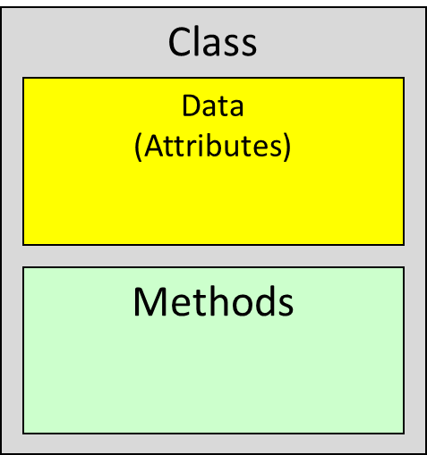

# Week3

# Loops (Iterations)

* for loops  (fixed number of times)
* ```java
  for(initialization; test; update){
  statement(s);
  }
  ```

* while loops (not fixed)

  ```java
  while (condition){
  	statement(s);
  }
  ```
* do ... while loops (not fixed)

  ```java
  do{
  	statement(s);
  }while(conditon);
  ```

# Array

* Creating one array

  ```java
  int[] numbers = new int[6]; //elements all 0
  int numbers[] = new int[6]; //elements all 0
  int[] numbers = {2, 3, 5, 0, 1, 4};
  ```

* Accessing array
* ```java
  for(int i = 0; i < numbers.length; i++){
    System.out.println(“numbers[“+”i”+”]:”+numbers[i]);
  }
  ```

# Object-Oriented Programming(面对对象的程序设计)

* You have learned structured programming（结构化编程）

  * Breaking tasks into subtasks（任务分成子任务）
  * Writing re-usable methods to handle tasks（可重复化任务）
* We will now study Objects and Classes

  * To build larger and more complex programs
  * To model objects we use in the world

> *A class describes objects with the same behavior. For example, a Car class describes all passenger vehicles that have a certain capacity and shape*

下面是车的Class及其中的方法，还有如何调用的例子：

```java
public class Car {
    // 定义类的属性
    String make;
    String model;
    int year;
  
    // 定义类的方法
    void start() {
        System.out.println("启动 " + make + " " + model);
    }
  
    void stop() {
        System.out.println("停止 " + make + " " + model);
    }
}

```

以上代码定义了名为Car的类，其中包含三个属性(attribute)，Car类中包含两个方法：start()及stop()，分别用于启动和停止汽车。

```java
public class TestCar {
    public static void main(String[] args) {
        // 创建一个 Car 对象
        Car myCar = new Car();
      
        // 设置对象的属性值
        myCar.make = "Toyota";
        myCar.model = "Camry";
        myCar.year = 2022;
      
        // 调用对象的方法
        myCar.start();
        myCar.stop();
    }
}

```

以上代码创建一个名为myCar的Car对象，且设置了属性值，最后调用了Car类中的start()和stop()方法

# Classes and Objects

* A class is a general concept of some particular type of ***object***. Different objects of that type are ***instances*** of that class.
* If you think of those individual cats as cat **objects**, then a Cat **class** would be the general concept of a cat.
* An **object** is an **instance** of a class and exists in memory, and performs a specific task.
* Objects have two general capabilities:

  * Objects can **store data**. The pieces of data stored in an object are known as instance variables, attributes or fields.

    对象可以存储数据，储存在对象中的数据块被称为实例变量（instance variable），属性(attributes)或字段(fields)，下例所示，myCar为一个对象 

    ​`Car myCar = new Car();`​

  * Objects can **perform operations. ​**The operations that an object can perform are known as *methods*

# Objects and Programs

* Java programs are made of **objects** that interact with each other
* When a program needs the services of a particular type of object, we create an **instance** of the class and call the **required methods**.创建实例并调用所需方法
* For example, the Scanner class provides methods:

  * Examples:  nextInt() and hasNextInt() methods
  * ```java
    Scanner scan = new Scanner(System.in);
    int width;
    System.println("the width of the room");
    width=scan.nextInt();
    ```

# Diagram of a Class

Data

* Each object has its own data that is stored in the attributes

Methods

* Manipulate the information stored in the object
* ​​

# Real Example of a Class

```java
public class Student {
    public int studentId;
    public String name;
    public String tutor;
    public Student(String sName) {
        name = sName; //this.name = sName;
		}
}
```

> 这段代码定义了一个`Student`​类，它包含了三个公共（public）实例变量（instance variables），即`studentId`​、`name`​和`tutor`​，以及一个公共构造方法（constructor）。
>
> 这个构造方法接受一个字符串参数`sName`​，它用来初始化`name`​实例变量。在这个构造方法的实现中，我们将参数`sName`​赋值给`name`​，以便在创建`Student`​对象时为`name`​实例变量赋值。
>
> 在这个构造方法中，`name = sName;`​是一个简单的赋值语句，它将`sName`​的值赋给`name`​。这里使用的是成员变量的简单赋值方式，也可以使用`this`​关键字来指定要赋值的是当前对象的`name`​实例变量，即`this.name = sName;`​。
>
> 这个构造方法只有一个参数，也就是`sName`​，它只为`name`​实例变量赋值。如果我们需要为其他实例变量赋值，就需要添加相应的参数或编写其他的构造方法。
>
> 总之，这个`Student`​类定义了三个实例变量和一个构造方法，它可以用来创建代表学生的对象，并为它们的实例变量赋值。

## Notes on the Student class

* This class lives in a file called Student.java这个类存在于一个名为Student.java的文件中

* This class only has a constructor  (a constructor always has the same name as that of the class)只有一个构造函数

* The public keyword means "publicly accessible" - code outside of this class can read and change the attributes of Student objects

  public关键字意为“公共可访问”——这个类之外的代码可以读取和更改Student类对象的属性

* This file doesn't run on its own; another file will contain the main program, which will create and do things with Student objects.

  该段代码不会自动运行；在另一个文件中将包含主程序（main program），该程序将会创建Student对象并对其进行操作
* Essentially this class just describes a handy container for three strings.

  本质上，该类Class只描述了一个容器，用于存放三个字符串

## Using Student objects

For example, some code using these objects could look like this:

```java
Student stu = new Student(“Daisy”);
stu.studentId = 2018050608;
stu.tutor = "Gore";
```

1. 第一行声明变量`stu`​并且初始化，调用构造函数创建对象
2. 为attibutes赋值

# Main class

* Java program needs a **main class**
* The main class must contain a **main method**
* Your program in the main class can be divided into **functions (methods).**
* The methods in the main program does not belong to any class and are **static methods**主程序中的方法不属于任何类，是静态方法

## **Naming Classes and Objects**

* Classes are usually nouns that starts with capital letter. If they consist of two words both words are capitalised

  类通常以大写字母开头，若又两个单词组成，两个单词都要大写

  * Student
  * GoodStudent
* Variables that refer to objects should begin with a lower case letter (this is the normal convention for variable names)

  * Student   yearOneStudent

# Attributes/fields

* Properties of this entity该实体属性

* Variables that belong to this class变量

* Primitive or reference data type

```java
public class Student {
    public String studentId;
    public String name;
    public Lecturer tutor;
    public double[] marks;
}
```

# Methods

* Methods are a set of programming instructions executed by an object方法是对象所执行的一系列指令

* Methods make the object do something

* Methods don't do anything until they are called or invoked

* We call a method by placing it in our code
* The class methods define what actions an instance of the class can perform
* Methods headers have a format:

  * ```java
    public String getName(){
    return name;
    }

    Public void setTutor(String name){
    		tutor = name;
    }

    ```

# Use Methods

* you must instantiate an object of the class before you can invoke methods
* Then invoke methods of the object

```java
public static void main(String[] args)
{
  // Construct a student’s object   
  Student stu= new Student(“Peter”);
  // Invoke a non-static method of the object
  System.out.println(“Name is “ + stu.getName());   
}

```

# Accessor and Mutator Methods

通常情况下，属性是私有的，并通过公共的getter和setter方法来访问和修改。这种封装属性的方式可以确保属性的安全和一致性，并允许在对象的实现中进行内部变化，而不影响使用该对象的代码。

```java
public class Person {
    private String name;
    private int age;

    public String getName() {
        return name;
    }
    public void setName(String name) {
        this.name = name;
    }
    public int getAge() {
        return age;
    }
    public void setAge(int age) {
        this.age = age;
    }
}
```

使用Person类及getter和setter方法

```java
public class Example {
    public static void main(String[] args) {
        Person person = new Person();
        person.setName("Tom");
        person.setAge(25);
        System.out.println("Name: " + person.getName());
        System.out.println("Age: " + person.getAge());
    }
}
```

* Some methods fall into two categories:

  * 1. Accessor Methods:  'getter' methods

        * Asks the object for information without changing it
        * Normally return a value of some type

          ```java
          public String getTutor()
          public String getName()
          ```
    2. Mutator Methods:  'setter' methods

        * Changes values in the object
        * Usually take a parameter that will change an instance variable
        * Normally return void
        * ```java
          public void setName(String name)
          public void setTutor(String name)
          ```

# **Creating an object of a class: Constructor Definition**

* A constructor is used to build an object of a class

* The constructor will initialise all the attributes of the object

* Constructor name gets class name

```java
public class Student{
   ...//declare name, tutor, studentID... 
	public Student(String n){
		name = n; //this.name = n;
   }
}
```

* Constructor body is executed when new object is created
* Statements in constructor body will set the internal data of the object that is being constructed
* All constructors of a class have the same name
* Compiler can tell constructors apart because they take different parameters

# The Default Constructor

* If you do not supply any constructors, the compiler will make a **default constructor automatically**

  * It takes **no parameters**
  * •It **initializes all the attributes**

```java
public class Student
{
   ...//declare name, tutor, studentID...
   public Student()
   {
      name = "";
//By default, numbers are initialised to 0, booleans to false, and objects as null.

      tutor = "";
	studentID = 0;
   }
}
```

# Object References

* Objects and arrays are both reference variables. They are allocated memory and variables hold a reference to them

  * Arraray Reference

    ​`double[] values = new double[12];`​
  * Object Reference

    ​`CashRegister reg1 = new CashRegister();`​

# Array of objects

* Now that we have create a class •Student[] cohort = new Student[5];we can have as many instances of this class as we wish
* We can create an array of Students
* ​`Student[] cohort = new Student[5];`​
* The **elements** of an array can be either**​ primitive or reference types**.
* We can then have arrays of objects

# arrays

```java
int[] nums = new int[3];
Student[] students = new Student[3];

for (int i = 0; i < 3; i++) {
	students[i] = new Student();
}

```

# The Null value

* When the array of reference types is created all the cells will have null values.
* We can also test whether a reference variable has been assigned an object by checking the value null.
* Attempting to call a method on a variable whose value is null will result in an error (in fact this is one of the commonest errors you will encounter when  you try to write programs).

```java
Student[] students = new Student[3];

if (students[0]==null) {
     System.out.print("It's null");
}
```

‍
