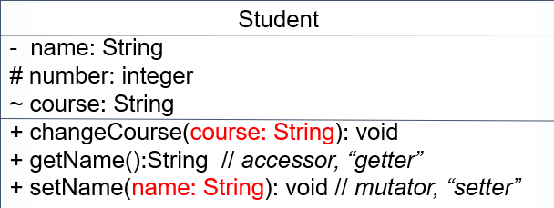
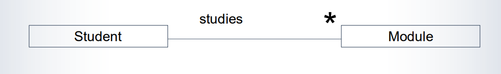

# Week4-UML

# **UML – Unified Modeling Language**

* Devised by OMG – Object-Management Group
* Brings together various diverse notations for systems design
* Widely used around the world

# Classes and Objects

* **A class** is a general concept of some particular *type of object.*类的概念
* Objects of that type are instances of that class.

  对象是该类的实例
* In UML a class is represented by a rectangle（矩形）.

# showing variables and methods

* Sometimes we only want to show the class (-name).
* But we can also show attributes (also known as fields, or instance variables ).

  属性
* We can also show operations (methods).

  方法

​		​​

* Words “attributes” and “operations” often omitted:（可被省略）

​​		​​

# showing data types

* Can add data types（添加数据类型）
* Note order is *variable* ":" type (as in Pascal language)

  顺序是`Variablename:Datatype`​

* Empty parentheses, ( ), indicate a method (operation)

  ()表示为一个方法

​​

# Visibility in Java

The main forms of visibility are:

* **public**, indicated by the keyword public – all classes can see and change

  Public关键字修饰的变量所有类可见及可更改
* **Private**, indicated by the keyword private – only methods within the own class can see

  Private关键字修饰的变量只有该变量所属类才能看到

Usually attributes are private and methods are public

​​

# Indicating visibility

* *Public ​*components shown by "+"

  Public关键字修饰的用"+"修饰

  * typically (some) methods are made public.
* *Private* components shown by "-"

  Private关键字修饰的用"-"修饰

  * typically instance variables are made private and can be reached only through (public) **accessor and mutator** methods ("getters" and "setters").

    实例变量通常为Private，只能通过get和set方法访问
* *Protected* components shown by “#”
* *Default* components shown by “~”

​​

# Student class

```java
public class Student {
    //3 private attributes
    protected int number;
    private String name;
    String course;
    //constructor
    public Student(String name, int number) {
        this.name = name;
	this.number = number;
	  }
    //3 public methods
    public void changeCourse(String course) {
		this.course = course;
	   }
    public String getName() {
		return name;
	   }
    public void setName(String name) {
		this.name = name;
     }
}

```

# Showing associations


A class-association diagram* shows the relationship  (association) between objects of the classes.类关系图显示类的对象间的关系

* The association is that an object of class *Student studies ​*an object of the class *Module*

  主程序为Module，创建一个名为studies的Student类

# Naming associations

We name an association (relationship) by writing a word, typically a verb* , above the line.横线上命名关系

It normally indicates the association when read left to right.从左往右读表示关联

In this example, the association is that an object of  class Student studies an object of the class Module.

Student类的对象学习Module的对象

​​

# Direction of associations

If we need the association to be read in a different direction we can add a little triangle to show the intended direction of reading:不同方向上读取

​​

# multiplicities

We can also show the multiplicities of an association. 

For example, if a student can study any number of modules then we can indicate this multiplicity by an asterisk (*) at the Module end of the association line:

​​

# Multiplicities – other way too

We can also show the multiplicities of an association in the other direction.

For example, if a module can be studied any number of students then we can indicate this multiplicity by an asterisk (*) at the Student end of the association line

**一个Module可供任意数量的学生学习**

​​

# Multiplicities – number ranges

We can also show the actual numbers of a multiplicity of an association.

For example, if a student must study exactly 5 modules, we would write 5 for the multiplicity at the Module end.

一个学生必须学习5个Module

​​

# Multiplicities – number ranges both ends

If there is a limit to the number of students, say 20, who may study a module, then we could change to:

​​

# Representing associations in programming

* We can encode the association in our class definitions:

  For example, we could have an attribute in the class Student, say called modules, that is an array of references to objects of the class Module. When we instantiate the array we would  give as its size, the maximum number of modules  a student is allowed to study.

```java
private Module[ ] modules;
private int numModules; // 0 .. 5
```

# Representing associations in  programming: constructor

In the constructor for the class Student we would have:

```java
public Student (String name, …) {
this.name = name;
/**
...
...
*/
modules = new Module[5]; // space for 5 modules
numModules = 0; // no modules so far
}
```

# Partly filled arrays

An array requires a dimension but we may not  need all the cells.

Students can study up to 5 modules but he or she may only study 2 modules this year 

We then need two variables：

```java
Module[] modules = new Module[5]; // the array
int numModules = 0; // a counter to keep track of filled cells 
```

# Adding a module

We will write a method addModule in the class Student to add a module module:

```java
public void addModule(Module module) {
modules[numModules] = module; // at end of array
numModules++; // one more module 
}
```

> Note: We have presumed that the student has not reached the limit of  modules, that the module module exists, is not already being studied  by this student and that the module module has room for another student

# deleting a module

We will also need a method deleteModule in the class Student to delete a module from the student's programme.

```java
public void deleteModule(int pos) {
int i = pos;
while (i < numModules - 1) { 
modules[i] = modules[i+1]; // copy down
i++;
} // i == numModules-1
numModules--; // one less now
}
```

> Note: we have a precondition when this method is called:  0<= pos < numModules

# ArrayList

As you can see, the method deleteModule is a  bit tricky to program if we represent the modules being studied as an array.

Soon we will tell you about a very useful  construct, the ArrayList, which makes deleting  and other operations much easier …
