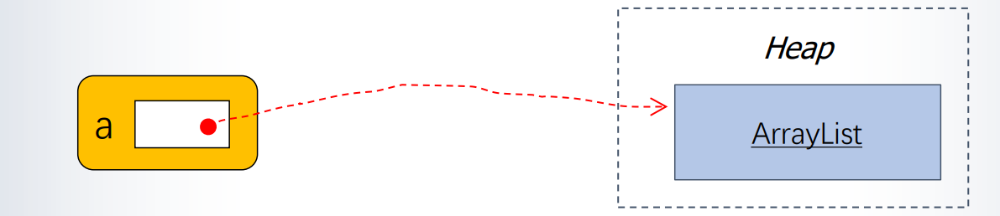

# Week5-ArrayList

# Picturing Primitive Types

* In Java every variable has a type, a name  and a value.

* If we execute the line `int i = 42;`​

Then the type of i is integer. We can picture its name and value like this

​​

# Comparing Two Variables Using the == Operator

If two variables are compared using the == operator then they are considered to be equal if their values are the same.

若值相同，则认为相等

# Array and ArrayList

* We have also met arrays, but came across the limitation that the size of the array must be determined  when it is created, and cannot thereafter be changed

  数组长度在创建后不能更改

  * In last week exercises we have a limitation of 20 students per module
  * If we cannot put an upper limit on the number of students,  then arrays are not a solution. What we need is something  that works a bit like an array, but which can expand to  accommodate any number of students
* If we want a collection of values that can grow  dynamically to accommodate new data then we must  use some other means of storing that data. One such  mechanism is the ArrayList class

  动态增长适应新数据，则使用ArrayList类

# Lists

Lists are flexible-length data structures where  the data is ordered in a linear fashion.长度灵活，数据以线性方式排序

Each element of the list holds some data.

* Array

  * Arrays are fixed-length:  once memory is  assigned, the length of  the array remains fixed.一旦分配内存，则数组的长度固定
  * Data structures that are  fixed-size are known as  static data structures.

    固定大小的数据结构被称为静态数据结构
* Lists

  * Lists can grow or shrink in length as a program runs.列表长度可灵活变化
  * Data structures that can change in size whilst a program runs are known  as dynamic data structures动态数据结构

# Declaring an ArrayList variable

We can declare that a variable `myStringList`​ refers to **ArrayList** whose elements are Strings as follows：

```java
import java.util.ArrayList;
...
ArrayList<String> myStringList;
```

This is similar to the declaration of an array (as illustrated below), in that all we are doing is to declare that a variable will refer to a collection of  values. The declaration does not, itself, allocate  any space for that collection

​`String[] myStringArray;`​

# Initialising an ArrayList

We can declare that a variable myStringList refers to ArrayList whose elements are Strings and allocate space for it as follows:声明变量myStringList指向arraylist，数组列表元素为string类型，并为其分配空间

```java
ArrayList<String> myStringList; //declaration
myStringList = new ArrayList<>(); //allocation of space

```

The declaration and initialisation can be combined into a single line as  follows:

​`ArrayList<String> myStringList=new ArrayList<>()`​

This is **similar** in some respects to the code shown below for arrays

​`String[] myStringArray = new String[5];`​

However we have to say how much space we want to allocate for the  array. In the example above it can contain no more than 5 values. The ArrayList code allocates an "expandable" amount of space for the  ArrayList.

然而，我们必须说明我们想要为数组分配多少空间。在上面的例子中，它可以包含不超过5个值。数组列表代码为数组列表分配一个“可扩展”的空间量。

‍

# Adding Values to an ArrayList

If `myStringList`​ is an `ArrayList`​ of Strings, we can add values to it as illustrated below: 

​`myStringList.add("Daisy");`​

​`myStringList.add("Sunny");`​

The result of this code is that myStringList contains the Strings "Daisy" and "Sunny", in that order.

Each element has an index, and indexes start at 0. In other words "Daisy" is the element at index 0, and "Sunny" is the element at index 1.

# Retrieving Values from an  ArrayList检索

To retrieve values from an ArrayList, we use  the get method as illustrated below

​`myStringList.add("Daisy");`​ 

​`myStringList.add("Sunny"); ​`​

​`String s = myStringList.get(1);`​

The last line above retrieves the element at index 1 (in this case "Sunny") and assigns it to the variable s 检索索引为1的元素为Sunny，则将其赋值给变量S

# Picturing Reference Types

If we execute the statement

​`ArrayList<String> a = new ArrayList<>();`​

This is what happens… 

1. A new ArrayList object is created. Java allocates space for this object  in a region of memory known as the heap.

    创建一个新的Arraylist对象，在被称为堆的内存区域中为该对象分配空间

2. Java makes a note of where in the heap it has stored the object.

    记录了在堆中存储对象的位置

3. The value of a is set to be a reference to this location. ArrayList is  said to be a reference type, as are other types whose values are  locations on the heap (for example `String`​)​

​​	

# Reference Types and Assignment

If we perform an assignment on a reference type variable, we change its value. That is to say that we change the location that it points to.

```java
ArrayList<String> a; 
ArrayList<String> b;
a = new ArrayList<>();
b = a;
a.add("Daisy");
b.add("Sunny");
if (a==b) {
System.out.println("ArrayLists are equal");
}
System.out.println("a.get(1) = " + a.get(1));
System.out.println("b.get(1) = " + b.get(1));
```

当我们对一个引用类型变量进行赋值操作时，实际上是改变了它的值，也就是改变了它所指向的位置或对象。

在给 `b`​ 赋值时，我们将 `a`​ 的值赋给了 `b`​，也就是说 `b`​ 指向了与 `a`​ 相同的 ArrayList 对象。由于 `a`​ 和 `b`​ 指向同一个对象，对其中一个对象做修改时，另一个对象也会受到影响。

在给 `a`​ 添加元素时，通过 `a.add("Daisy")`​ 向 `a`​ 对应的 ArrayList 添加了一个元素 "Daisy"。然后，通过 `b.add("Sunny")`​ 向 `b`​ 对应的 ArrayList 添加了另一个元素 "Sunny"。

因为 `a`​ 和 `b`​ 指向同一个 ArrayList 对象，所以实际上是向同一个对象中添加了两个元素。

接下来的条件判断 `if (a==b)`​ 用于检查 `a`​ 和 `b`​ 是否引用同一个对象。由于 `a`​ 和 `b`​ 的引用值相同，即指向同一个对象，条件成立，因此会输出 "ArrayLists are equal"。

最后，通过 `a.get(1)`​ 和 `b.get(1)`​ 分别获取 `a`​ 和 `b`​ 对应的 ArrayList 中索引为 1 的元素。由于两者引用的是同一个 ArrayList 对象，因此输出的结果相同，即 "Sunny"。

综上所述，通过给一个引用类型变量赋值，实际上是改变了它所指向的对象，这使得多个引用变量可以同时引用同一个对象，从而对该对象进行操作时，所有引用变量都会受到影响。

‍

# Reference Types and the ==  Operator

If we create two ArrayLists as follows

```java
ArrayList<String> a = new ArrayList<>();
ArrayList<String> b = new ArrayList<>();
```

The variables a and b have different values, because the  values are locations on the heap.a和b创建对象不同，因此a和b有不同的值，即在堆中的逻辑地址不相同

The values are different in the sense tested by the == operator, and will remain different, even if the contents of the two ArrayLists are the same

```java
a.add("Daisy");
b.add("Daisy");
if (a==b) {
System.out.println("ArrayLists are equal");
}
```

It is not just ArrayList that works in the way we have just illustrated.

If a variable is not a primitive type, then it is a **reference type**, and its  value is a location on the heap.

The Scanner and String classes are reference types.Scanner和String类也是引用类型

There are only 8 primitive types, and we have already met them all. 

int long short char byte float double boolean

So any new type that you encounter is a reference type!

除了以上8种基本类型，其他都是引用类型

在 Java 中，引用类型（Reference Type）是一种数据类型，用于表示对象的引用（或称为引用变量）。引用类型可以引用（指向）对象，在内存中存储对象的地址信息。

与引用类型相对的是基本数据类型（Primitive Type），基本数据类型直接存储数据的实际值，而引用类型存储的是对象的引用（地址），通过这个引用可以访问和操作对象。

在 Java 中，引用类型包括类（Class）、接口（Interface）、数组（Array）等。通过使用引用类型，可以创建和操作复杂的对象，包括自定义的类对象、数组对象以及集合框架中的对象（如 ArrayList、HashMap 等）等。

引用类型的特点包括：

1. 对象的引用：引用类型变量存储的是对象在内存中的地址，通过这个引用可以访问和操作对象的属性和方法。
2. 动态内存分配：引用类型的对象通常在运行时动态分配内存，可以根据需要创建和销毁对象。
3. 对象的共享和传递：引用类型的变量可以相互赋值，多个变量可以引用同一个对象，实现对象的共享和传递。

需要注意的是，引用类型变量本身存储的是对象的引用，而不是对象的实际数据。对引用类型变量进行操作时，实际上是在操作对象本身。

‍

# Special Reference Type String

```java
public class Test {
public static void main(String[] args) { 
// String created using String literal
String s1 = "TAT"; 
String s2 = "TAT"; 
// String created using 'new' keyword
String s3 = new String("TAT"); 
String s4 = new String("TAT"); }
}
```

在这段代码中，我们创建了四个字符串对象，使用了不同的方式：

1. ​`String s1 = "TAT";`​：使用字符串字面量创建字符串对象。在 Java 中，字符串字面量是以双引号括起来的文本，编译器会自动将其转换为字符串对象。在这种情况下，如果字符串常量池中已经存在相同内容的字符串，则会直接使用该字符串对象，而不会创建新的对象。因此，`s1`​ 和 `s2`​ 引用同一个字符串对象。
2. ​`String s3 = new String("TAT");`​：使用 `new`​ 关键字显式地创建了一个新的字符串对象。即使字符串内容与之前创建的字符串相同，使用 `new`​ 关键字仍然会创建一个新的字符串对象。因此，`s3`​ 和 `s4`​ 引用的是两个不同的字符串对象。

总结来说，对于字符串字面量，Java 会尽可能地重用已有的字符串对象，以提高性能和节省内存。而使用 `new`​ 关键字创建的字符串对象，无论内容是否相同，都会创建一个新的对象。

在这段代码中，`s1`​ 和 `s2`​ 引用同一个字符串对象，因为它们的值相同且都是使用字符串字面量创建的。而 `s3`​ 和 `s4`​ 引用两个不同的字符串对象，因为它们是使用 `new`​ 关键字分别创建的。

# Methods

* One of the things that distinguish reference types from primitive types is that if you can call  methods on a variable of reference type.

  引用类型与基本类型的区别之一：是否可以在引用类型的变量上调用方法

* The add and get methods that we have just met are examples of methods that can be called on an ArrayList object
* You can't call a method on a primitive type

```java
public class Person {
    private String name;

    public Person(String name) {
        this.name = name;
    }

    public void sayHello() {
        System.out.println("Hello, my name is " + name);
    }
}

public class Test {
    public static void main(String[] args) {
        Person person = new Person("Alice");
        person.sayHello();
    }
}
```

在上面的例子中，我们定义了一个 `Person`​ 类，它有一个 `sayHello()`​ 方法。在 `Test`​ 类的 `main`​ 方法中，我们创建了一个 `Person`​ 对象并赋值给 `person`​ 变量。接着，我们可以通过 `person`​ 变量来调用 `sayHello()`​ 方法，输出 "Hello, my name is Alice"。

这个例子中，`person`​ 是一个引用类型变量，它引用了一个 `Person`​ 对象。因为 `Person`​ 类中有 `sayHello()`​ 方法，我们可以通过 `person`​ 变量调用该方法，执行相应的逻辑。

总结起来，引用类型的变量可以调用所引用对象的方法，这是引用类型与基本数据类型之间的一个区别。这使得我们可以在引用类型中封装数据和行为，并通过方法调用来操作对象的状态和行为。

# Instance Methods and Static Methods

* In Java there are two different kinds of methods, instance methods  and static methods:
* Instance methods have to be called on a particular object, and can  do different things if called on different objects. For example the  add, and get methods that can be called on a ArrayList object  are instance methods.

  实例方法需要在特定对象上调用。在ArrayList对象上调用的add和get方法都是实例方法

* Static methods, do not need to be called on any particular object. They can be used in the main Class to divide the main method into sub programs.

  静态方法不需要在任何特定对象上调用，可以在主类中使用，将主方法划分为主程序。

# More ArrayList Methods

If a is a ArrayList variable, i is an int, and e is an object whose type  matches the element type of the ArrayList then…

* ​`a.size()`​

  Returns the number of elements in the list返回元素个数
* ​`a.add(i,e)`

  Adds element e to the list at index i. All elements at indexes greater than i get  moved up to accommodate the new  element (in other words their indexes  increase by 1)将元素e添加到索引为i的列表中。
* ​`a.remove(i)`​

  Removes the element at index i移出位于索引i的元素
* ​`a.get(i)`​

  Returns the element e at index i, the element is not removed from the list返回索引为i的元素e，该元素不会从列表中移除

* ​`a.clear()`​

  Removes all elements from the  ArrayList移除所有元素

# Calling an Instance Method

* To call an instance method, Java needs to know three things:

  * The object on which the method is to be called.调用方法对象
  * The name of the method.方法名
  * The value(s) of its actual parameter(s) (if there are any).实际参数的值

​`a.add(“Daisy");`​a:调用该方法的对象的引用，add:方法名，"Daisy"：参数值

# Calling a Static Method

If you wish to call a static method that belongs to a class other than the one from which you are making the call, then you must prefix the method with the name of the class (not an object of this  class). For example`double x = Math.sqrt(2);`

如想调用其他类中的静态方法，那么在方法前面加上类的名称

Calls the `sqrt`​ (square root) method of the `Math`​ class​

If you are calling one method from another method in the same class, then you do not need to prefix the method call with the  name of the class.

```java
public static void main(String[] args) {
int val = 3;
printFactorial(val);
}
public static void printFactorial(int n) {
System.out.println(n);
}
```

# Method Overloading

方法重载（Method Overloading）是指在一个类中定义多个同名的方法，但它们的参数列表不同（参数类型、参数个数或参数顺序）。通过方法重载，可以使用相同的方法名来完成不同的操作。

方法重载的特点包括：

1. 方法名相同：重载的方法具有相同的名称。
2. 参数列表不同：重载的方法在参数列表方面具有差异，可以通过参数类型、参数个数或参数顺序来区分。
3. 返回类型可以相同也可以不同：方法重载与返回类型无关，只要参数列表不同即可。

方法重载的优点是提高了代码的可读性和灵活性。通过使用相同的方法名，我们可以根据不同的参数来调用不同的方法，使代码更加简洁和易于理解。例如，可以定义一个`calculateArea(int width)`​ 方法来计算矩形的面积，同时也可以定义一个 `calculateArea(int width, int height)`​ 方法来计算矩形或正方形的面积，而不需要为不同的情况分别命名不同的方法。

举一个简单的例子来说明方法重载：

```java
public class Calculator {
    public int add(int a, int b) {
        return a + b;
    }

    public double add(double a, double b) {
        return a + b;
    }

    public int add(int a, int b, int c) {
        return a + b + c;
    }
}

public class Test {
    public static void main(String[] args) {
        Calculator calculator = new Calculator();

        int sum1 = calculator.add(1, 2);
        double sum2 = calculator.add(2.5, 3.7);
        int sum3 = calculator.add(1, 2, 3);

        System.out.println("Sum 1: " + sum1);
        System.out.println("Sum 2: " + sum2);
        System.out.println("Sum 3: " + sum3);
    }
}
```

在上面的例子中，`Calculator`​ 类定义了三个 `add`​ 方法，它们的参数列表不同。第一个 `add`​ 方法接受两个整数参数，第二个 `add`​ 方法接受两个 double 类型参数，第三个 `add`​ 方法接受三个整数参数。通过方法重载，我们可以根据不同的参数类型和个数来调用不同的 `add`​ 方法。在 `Test`​ 类的 `main`​ 方法中，我们通过不同的参数调用了不同的 `add`​ 方法，并输出了计算结果。

注意，方法重载要求方法在同一个类中具有不同的参数列表，但不能仅仅通过不同的返回类型进行重载。

‍

# Declaring Reference Type Variables

To declare a reference type variable we specify the type of the object that the variable will point to. We may also have to  supply a type parameter for this variable, enclosed in angle brackets < … >

需要指定该变量指向的对象类型。还可能需要为变量提供类型参数，用<>括起来

When declaring an ArrayList we supply a type parameter  to indicate the type of element the ArrayList contains, for example `​ ArrayList<String> a;`​

Other reference types, such as String, or Scanner, do not require a type parameter

​`Scanner scanner;`​

# Constructors

When we create an object, the keyword new is followed by a constructor for the object.关键字new后跟对象的构造函数

A constructor has a name, which is always the same as the type of  the object being created. It may take type parameters, enclosed in  angle brackets <..> and actual parameters, enclosed in round  brackets (…). The type parameter can often be replaced by an  empty set of angle brackets <>

Example：

​`ArrayList<String> a = new ArrayList<String>();`​

​`ArrayList<String> a = new ArrayList<>();Scanner scanner = new Scanner(System.in);`

‍
